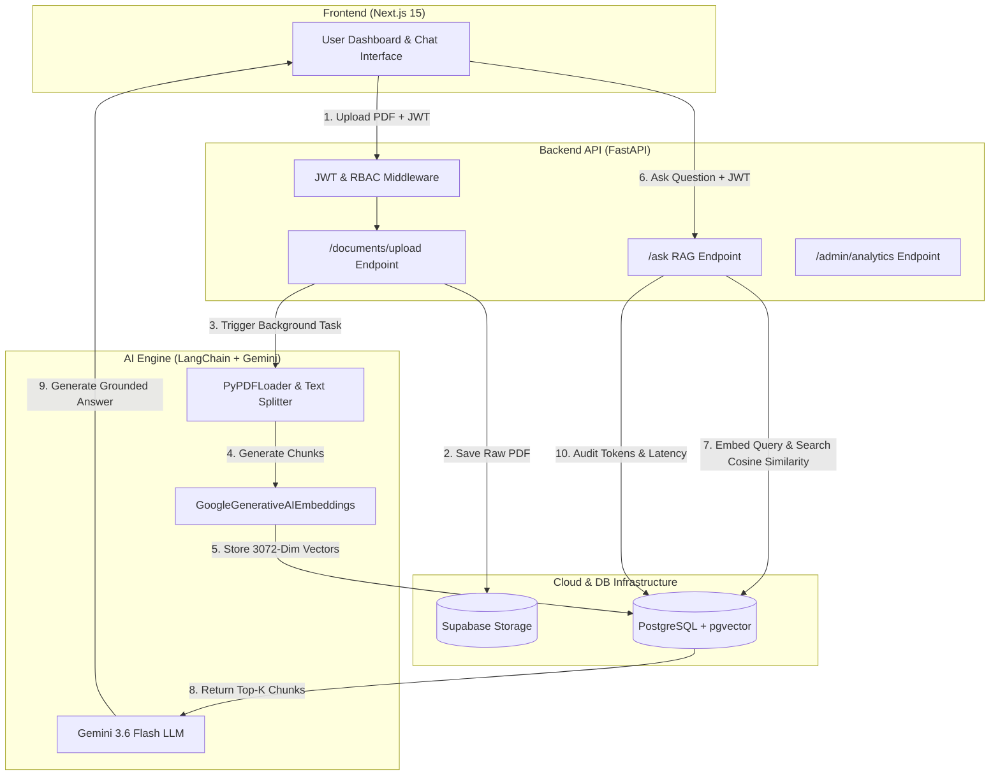

# DocMind AI 🚀

**Enterprise AI Document Intelligence & Multi-Tenant Retrieval-Augmented Generation (RAG) Platform**

[](https://fastapi.tiangolo.com/)
[](https://nextjs.org/)
[](https://github.com/pgvector/pgvector)
[](https://python.langchain.com/)
[](https://ai.google.dev/)
[](LICENSE)

---

## 📌 Table of Contents

- [Overview](#-overview)
- [Key Features](#-key-features)
- [System Architecture](#-system-architecture)
- [Tech Stack](#-tech-stack)
- [Database Schema & Vector Search](#-database-schema--vector-search)
- [Project Structure](#-project-structure)
- [Getting Started](#-getting-started)
  - [Prerequisites](#1-prerequisites)
  - [Backend Setup](#2-backend-setup)
  - [Frontend Setup](#3-frontend-setup)
- [API Reference](#-api-reference)
- [Token & Cost Analytics](#-token--cost-analytics)
- [Contributing](#-contributing)
- [License](#-license)

---

## 💡 Overview

**DocMind AI** is an end-to-end, enterprise-ready Document Intelligence platform designed to extract, index, and query corporate documents using high-dimensional vector similarity search and context-bounded generative AI. 

Traditional keyword search fails to understand semantic context in complex PDF contracts, policy guidelines, and financial reports. DocMind AI solves this by combining **Multi-Tenant Security**, **PostgreSQL Vector Search (`pgvector`)**, **Google Gemini 3.6 Flash (`gemini-3.6-flash`)**, and **Real-Time Token Cost Tracking** to deliver fast, accurate, hallucination-free answers with precise source chunk attribution.

---

## 🔥 Key Features

- 🏢 **Multi-Tenancy & RBAC**: Strict organization-level data segregation with `ADMIN` and `EMPLOYEE` role-based permissions.
- ⚡ **Asynchronous Document Ingestion**: Non-blocking PDF uploads to Supabase Storage with FastAPI background workers processing PDF extraction and chunking.
- 🎯 **Advanced Vector Processing**: PDF parsing via `PyPDFLoader`, hierarchical splitting via `RecursiveCharacterTextSplitter` (500 char chunk size, 100 char overlap), and vector embedding generation via `GoogleGenerativeAIEmbeddings` (3072 dimensions).
- 🗄️ **PostgreSQL + pgvector**: In-database cosine distance similarity search (`1 - cosine_distance`) directly integrated via SQLAlchemy 2.0.
- 🔗 **LangChain LCEL RAG Pipeline**: Declarative chain architecture (`RunnableParallel`, `RunnablePassthrough`) connecting vector retrieval to Gemini 3.6 Flash with zero-hallucination prompt guardrails.
- 📊 **Real-Time Cost & Token Analytics**: Live tracking of prompt tokens, completion tokens, latency, and exact financial cost calculation based on Gemini standard pricing ($0.75 / 1M input, $3.75 / 1M output).
- 🧠 **Executive AI Insights**: Automated, AI-generated periodic summaries for Organization Administrators analyzing token consumption, employee usage patterns, and cost optimization recommendations.
- 💻 **Modern Next.js Dashboard**: High-performance UI built with Next.js 15, TypeScript, and Tailwind CSS.

---

## 🏗️ System Architecture



---

## 🛠️ Tech Stack

| Layer | Technology | Description |
| :--- | :--- | :--- |
| **Backend API** | FastAPI, Uvicorn, Pydantic v2 | High-performance Python web framework with async support and automatic OpenAPI docs |
| **Database & ORM** | PostgreSQL, `pgvector`, SQLAlchemy 2.0, Alembic | Relational database with vector extension for cosine distance queries and migration management |
| **AI & RAG Engine** | LangChain (LCEL), `gemini-3.6-flash`, `gemini-embedding-001` | Document chunking, vector embedding, and context-bounded LLM generation |
| **Cloud Storage** | Supabase Storage SDK | Secure PDF file storage scoped by organization path |
| **Security** | PyJWT, `pwdlib` (Argon2 / Bcrypt) | JWT Bearer token authentication with password hashing |
| **Frontend UI** | Next.js 15 (App Router), TypeScript, Tailwind CSS | Responsive dashboard with authentication state management and analytics charts |

---

## 📊 Database Schema & Vector Search

The application uses SQLAlchemy 2.0 mapped models with a dedicated `VECTOR(3072)` column for storing vector representations.

```
+------------------+         +-------------------+         +--------------------+
|  organizations   | 1     * |       users       | 1     * |     documents      |
+------------------+---------+-------------------+---------+--------------------+
| id (PK)          |         | id (PK)           |         | id (PK)            |
| name             |         | organization_id   |         | organization_id    |
| created_at       |         | email             |         | uploaded_by (FK)   |
+------------------+         | password_hash     |         | filename           |
                             | role (ADMIN/EMP)  |         | storage_key        |
                             +-------------------+         | status             |
                                                           +--------------------+
                                                                     | 1
                                                                     | *
+------------------+         +-------------------+         +--------------------+
|   ai_requests    |         |  document_chunks  |         |  document_chunks   |
+------------------+         +-------------------+         +--------------------+
| id (PK)          |         | id (PK)           |         | content (Text)     |
| organization_id  |         | document_id (FK)  |         | embedding          |
| user_id (FK)     |         | chunk_index       |         | VECTOR(3072)       |
| question         |         +-------------------+         +--------------------+
| total_tokens     |
| estimated_cost   |
+------------------+
```

### Vector Similarity Search Query
Vector search is performed directly inside PostgreSQL using the `pgvector` extension:

$$\text{Similarity} = 1 - \text{CosineDistance}(V_{\text{chunk}}, V_{\text{query}})$$

```python
results = (
    db.query(
        DocumentChunk,
        (1 - DocumentChunk.embedding.cosine_distance(query_embedding)).label("similarity")
    )
    .filter(DocumentChunk.document_id == document_id)
    .order_by(DocumentChunk.embedding.cosine_distance(query_embedding))
    .limit(top_k)
    .all()
)
```

---

## 📁 Project Structure

```
DocMindAI/
├── backend/
│   ├── alembic/                 # Alembic database migrations
│   ├── app/
│   │   ├── langchain/           # LangChain LCEL RAG components
│   │   │   ├── document_loader.py
│   │   │   ├── embeddings.py
│   │   │   ├── rag_chain.py
│   │   │   ├── retriever.py
│   │   │   └── spilitter.py
│   │   ├── analytics.py         # Cost & token tracking module
│   │   ├── database.py          # SQLAlchemy engine & session setup
│   │   ├── documents_processor.py # Async PDF processing pipeline
│   │   ├── insights.py          # AI Executive Insights generator
│   │   ├── llm.py               # Gemini LLM & RAG prompt template
│   │   ├── main.py              # FastAPI application & route definitions
│   │   ├── models.py            # SQLAlchemy database models (pgvector)
│   │   ├── schemas.py           # Pydantic request/response schemas
│   │   ├── security.py          # JWT authentication & RBAC dependencies
│   │   └── storage.py           # Supabase Storage client
│   ├── .env.example             # Backend environment template
│   ├── Dockerfile
│   └── requirements.txt
├── frontend/
│   ├── app/                     # Next.js App Router pages
│   │   ├── login/
│   │   ├── signup/
│   │   └── workspace/           # Protected Admin & Document workspace
│   ├── lib/
│   │   └── api.ts               # Frontend API client library
│   ├── .env.example             # Frontend environment template
│   ├── package.json
│   └── tsconfig.json
├── DocMind_AI_Project_Revision_Guide.pdf # Project revision & viva document
└── README.md
```

---

## 🚀 Getting Started

### 1. Prerequisites

- **Python**: 3.11+
- **Node.js**: 18.x or 20.x
- **PostgreSQL**: Version 15+ with [`pgvector`](https://github.com/pgvector/pgvector) installed
- **Supabase Account**: For PDF cloud storage bucket
- **Google Gemini API Key**: For embedding generation and RAG reasoning

---

### 2. Backend Setup

1. **Navigate to the backend folder**:
   ```bash
   cd backend
   ```

2. **Create and activate a virtual environment**:
   ```bash
   python -m venv .venv
   # Windows:
   .venv\Scripts\activate
   # Linux/macOS:
   source .venv/bin/activate
   ```

3. **Install backend dependencies**:
   ```bash
   pip install -r requirements.txt
   ```

4. **Configure environment variables**:
   Copy `.env.example` to `.env` and fill in your credentials:
   ```bash
   cp .env.example .env
   ```
   *Set `DATABASE_URL`, `JWT_SECRET`, `GEMINI_API_KEY`, `SUPABASE_URL`, and `SUPABASE_KEY`.*

5. **Run database migrations**:
   ```bash
   alembic upgrade head
   ```

6. **Start the FastAPI server**:
   ```bash
   uvicorn app.main:app --reload --port 8000
   ```
   *FastAPI interactive docs will be available at `http://localhost:8000/docs`.*

---

### 3. Frontend Setup

1. **Navigate to the frontend folder**:
   ```bash
   cd ../frontend
   ```

2. **Install frontend dependencies**:
   ```bash
   npm install
   ```

3. **Configure environment variables**:
   Copy `.env.example` to `.env.local`:
   ```bash
   cp .env.example .env.local
   ```

4. **Start the Next.js development server**:
   ```bash
   npm run dev
   ```
   *Open `http://localhost:3000` in your web browser.*

---

## 📡 API Reference

### Authentication
- `POST /auth/register` — Register a new Organization & Admin account.
- `POST /auth/login` — Authenticate and receive a JWT bearer token.

### User & Employee Management
- `GET /users/me` — Retrieve logged-in user profile.
- `POST /users/employees` — Admin endpoint to register new employee accounts.
- `GET /users/employees` — List all employees belonging to the admin's organization.

### Documents & Search
- `POST /documents/upload` — Upload PDF file (triggger asynchronous background processing).
- `GET /documents` — List all documents belonging to the organization.
- `POST /search` — Perform vector similarity search over document chunks.
- `POST /ask` — Execute end-to-end RAG question answering.

### Admin Analytics & Insights
- `GET /admin/analytics?days=30` — Aggregate total requests, token counts, costs, latency, and breakdown by model/user.
- `GET /admin/insights?days=30` — Generate AI executive summary report of organization usage.

---

## 💰 Token & Cost Analytics

DocMind AI monitors LLM expenses using exact token counts returned from the Gemini API:

| Metric | Cost per Million Tokens |
| :--- | :--- |
| **Input (Prompt) Tokens** | $0.75 |
| **Output (Completion) Tokens** | $3.75 |

Every query logged in `ai_requests` records latency, exact token usage, and computed financial cost, enabling organization admins to track consumption and set budgetary limits.

---

## 📄 Project Revision Document

For code walkthroughs, viva interview questions, and detailed system design concepts, check out the generated revision guide:
📌 **[`DocMind_AI_Project_Revision_Guide.pdf`](./DocMind_AI_Project_Revision_Guide.pdf)**

---

## 🤝 Contributing

Contributions are welcome! Feel free to open an issue or submit a pull request if you find bugs or want to add new features.

---

## 📜 License

Distributed under the MIT License. See `LICENSE` for more information.
